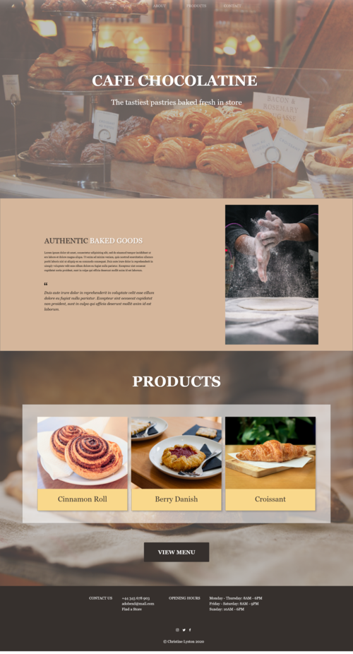

# Cafe Chocolatine

Cafe Chocolatine is a mock cafe single page website. This is my own design made with Adobe XD.

### Live Preview:

## Technologies Used

HTML, CSS, GIT.

## Personal Learnings

This project was my first time designing a website, and I used Adobe XD to create the design. I created a moodboard of various restaurant designs on Behance, and used them to inspire my own design.

## Installation Instructions

To run Cafe Chocolatine, download this project and then run on a local server of your choice.

#### Written by Christine Lyston
#### Date: November 2020